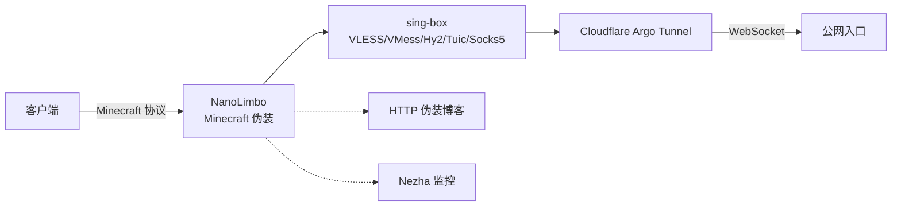

# JAVA-Minecraft-Limbo

一个伪装成 Minecraft Limbo 服务器的代理节点部署工具，专为免费 Java 容器（Serv00、CT8、Hostuno 等）设计。

单进程内同时运行 **Minecraft 协议伪装** + **sing-box 代理核心** + **Cloudflare Argo Tunnel**，所有组件通过 JNA 加载 native .so 实现，`ps` 只看到 java 进程。

## 工作原理



## 伪装特性

| 特性 | 说明 |
|------|------|
| Minecraft 协议 | 完整握手，支持 1.7.2 ~ 1.21 |
| 在线人数 | 3-20 人随机波动，50 个假玩家池 |
| MOTD 动态轮换 | 8 条描述池，每 2-4 分钟随机切换 |
| 最大玩家数 | 启动时随机 50~500 |
| HTTP 博客 | 可选个人博客伪装 |
| 连接日志 | 原生服务 stdout 重定向到文件，控制台不暴露 |

## 快速开始

### 1. 配置变量

在 [`ServerConfig.java` 配置区域](https://github.com/krisxu23/JAVA-Minecraft-Limbo/blob/main/src/main/java/ua/nanit/limbo/net/ServerConfig.java#L63-L108) 直接填写：

```java
this.uuid = "2523c510-...";         // 客户端 UUID
this.port = "25565";                // Minecraft 端口
this.wsPort = "8001";               // VMess+WebSocket 端口
this.realityPort = "30093";         // VLESS+Reality 端口
this.argoToken = "eyJ...";          // Argo Tunnel Token
this.argoDomain = "xxx.trycloudflare.com";
```

### 2. 构建并运行

```bash
git clone https://github.com/krisxu23/JAVA-Minecraft-Limbo.git
cd JAVA-Minecraft-Limbo
chmod +x gradlew
./gradlew clean shadowJar

# 自动启动脚本（推荐）
./start.sh

# 手动运行
java -XX:MaxRAMPercentage=40 -XX:+UseZGC -jar build/libs/server.jar
```

## 配置参考

| 字段 | 默认值 | 说明 |
|------|--------|------|
| `uuid` | `2523c510-...` | 客户端 UUID（必填） |
| `domain` | 自动获取 | 服务器域名/IP |
| `port` | `25565` | Minecraft 端口 |
| `wsPort` | `8001` | VMess+WebSocket 端口 |
| `realityPort` | `30093` | VLESS+Reality 端口（TCP） |
| `hy2Port` | `30093` | Hysteria2 端口（UDP） |
| `tuicPort` | — | Tuic 端口（UDP） |
| `socks5Port` | — | Socks5 端口（TCP） |
| `anytlsPort` | — | AnyTLS 端口（TCP） |
| `argoToken` | — | Argo Tunnel Token |
| `argoDomain` | — | Argo 固定域名（留空=临时隧道） |
| `disableArgo` | `false` | 禁用 Argo Tunnel |
| `cfIp` | `www.wto.org` | Cloudflare 优选 IP |
| `cfPort` | `443` | Cloudflare 优选端口 |
| `webPort` | — | HTTP 伪装博客端口 |
| `subPort` | — | 订阅端口 |
| `nezhaServer` | — | 哪吒监控域名 |
| `nezhaKey` | — | 哪吒监控 Key |
| `tgChatId` | — | Telegram 通知 Chat ID |
| `tgBotToken` | — | Telegram Bot Token |

> 配置区域直接跳转：[ServerConfig.java → L63-L108](https://github.com/krisxu23/JAVA-Minecraft-Limbo/blob/main/src/main/java/ua/nanit/limbo/net/ServerConfig.java#L63-L108)

## 内存说明

本程序在单进程内同时运行 JVM 和 sing-box/cloudflared（通过 JNA 加载 native .so）。

| 容器内存 | 建议 `MaxRAMPercentage` | Java 堆 | 留给 native |
|----------|------------------------|---------|-------------|
| 256MB | 35-40% | ~90-102MB | ~154-166MB |
| 512MB | 45-50% | ~230-256MB | ~256-282MB |
| 1GB | 55-60% | ~563-614MB | ~410-461MB |

`start.sh` 自动按此策略计算。也可通过 `JVM_ARGS` 覆盖：

```bash
JVM_ARGS="-Xmx128M -XX:+UseZGC" ./start.sh
```

## 输出文件

```
players.data       — 节点订阅链接（Base64）
lib/native.log     — 原生服务 stdout 日志（连接详情等）
lib/config.json    — sing-box 配置
lib/cert.pem       — 自签名证书
lib/key.pem
```